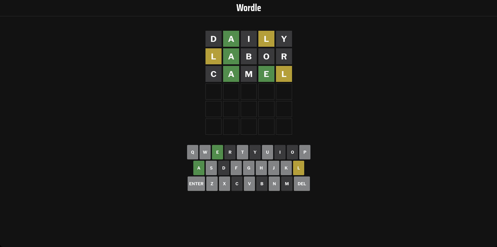

# Wordle clone

### A wordle clone made with _React_.

- Everytime you load the page, a new random word is selected.
- To play again, just hit refresh.
- Mobile view is supported.

Image example:

### Setup

#### Requirements

`NodeJS` and `npm`.

- For easily managing `NodeJS` and `npm` installations, use [`nvm`
  (Node Version Manager)](https://github.com/nvm-sh/nvm)

#### Step-by-step instructions

1. Run `npm install` to install the dependencies
2. Run `npm run dev` to start the application
